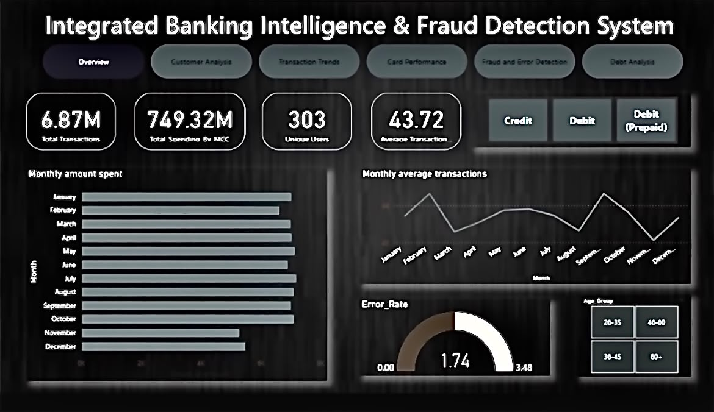

# Bank Intelligence and Fraud detection Dashboard

  

## Overview
This project is a comprehensive Banking Intelligence and Fraud Detection System built to analyze customer behavior, transaction patterns, debt exposure, and fraudulent activities using Excel-based data sources and interactive dashboards. It is designed to help banks make data-driven decisions, identify risks early, and monitor overall financial health through a centralized reporting solution.

## Project Description
The system processes four structured Excel datasets covering customer profiles, transaction records, debt information, and card usage. These datasets are transformed into an interactive multi-page dashboard that provides a 360-degree view of banking operations, enabling stakeholders to detect anomalies, evaluate credit risk, and track performance metrics in real time.

## Dashboard Pages

### 1. Overview
A high-level summary page displaying key performance indicators (KPIs) such as total customers, total transactions, overall fraud rate, and outstanding debt, giving decision-makers a quick snapshot of the bank's health.

### 2. Customer Analysis
Provides detailed insights into customer demographics, segmentation, account activity, and behavioral patterns to support targeted marketing and risk profiling.

### 3. Transaction Trends
Visualizes transaction volume and value over time, highlighting peak periods, spending patterns, and channel-wise (ATM, online, POS) transaction distribution.

### 4. Debt Analysis
Analyzes loan and credit exposure, repayment behavior, default rates, and outstanding balances to assess the bank's credit risk portfolio.

### 5. Fraud and Error Detection
Identifies suspicious transactions, flags anomalies, and tracks fraud patterns using rule-based and statistical detection techniques to minimize financial losses.

### 6. Card Performance
Evaluates credit and debit card usage, approval rates, active vs inactive cards, and revenue generated from card-based transactions.

## Data Sources
The dashboard is powered by four Excel files containing:
- Customer information and demographics
- Transaction-level records
- Loan and debt details
- Card issuance and usage data

## Objective
The primary goal of this system is to strengthen fraud prevention, improve customer risk assessment, and support strategic banking decisions through clear, actionable, and visually intuitive dashboards.

## Tools Used
- Microsoft Excel (Data Processing & Cleaning)
- Power BI / Excel Dashboards (Visualization)
- Pivot Tables & DAX/Formulas (Analysis)

## Conclusion
This Banking Intelligence and Fraud Detection System provides a reliable, all-in-one analytical solution for banks to monitor customer activity, detect fraud, manage debt risk, and evaluate overall performance efficiently.
